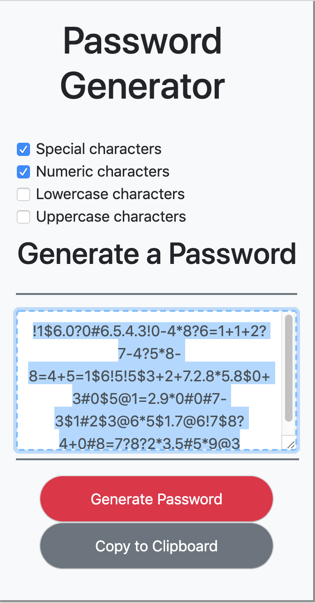

# homework-3-eu

Submission repository for third website/homework. 

All students were tasked with completing a fully responsive application using html, bootstrap's css library and javascript. 

Starting with the fully deployed application, below are examples of the application's output. 

Similarly, below are examples of the application's responsiveness by window size. 

 
Please let me know if you have any questions. 

Thanks,
Eduardo Urbaez
